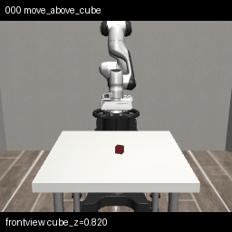

# AgentOS — 仿真优先的具身 Agent 运行框架

AgentOS 是一个 simulation-first 的具身 Agent 执行框架。它把"Agent 决策 → 环境执行"这条链路做成了一套**可审计、可恢复、可测试、可替换**的文件协议系统。

核心命题：**AI Agent 产出的动作，在被物理执行之前，应该经过什么样的安全边界？**

答案：一个多层的文件驱动协议——Planner → Tool → ACTION.md → Watchdog → Driver State Machine → ENVIRONMENT.md。

## 实际运行效果

Robosuite Lift 任务 — Panda 机械臂通过 5 阶段 FSM 策略完成 "lift the cube"：

<p align="center">
  
</p>

从上到下：机械臂先对齐方块（move_above_cube），然后下降（descend），闭合夹爪（close_gripper），最后夹着方块上抬（lift → hold）。整个过程由 AgentOS 全栈驱动——Planner、Tool、ACTION.md、Watchdog、Driver 全部参与。

---

## 一句话理解

```text
你说 "lift the cube"

→ SkillLibraryPlanner 匹配 robosuite_skill.md 里的 "robosuite_lift" 模板
→ AgentOSExecutor 执行 3 个 step（reset / lift_loop / render）
→ RobosuiteLiftLoopTool 每步调用 5 阶段 FSM 策略
→ 策略产出的 [dx, dy, dz, gripper] 写入 ACTION.md
→ Watchdog fcntl 锁住 ACTION.md，校验，通过 RobosuiteDriver 执行
→ MuJoCo 物理引擎里 Panda 机械臂移动到方块上方 → 下降 → 闭合夹爪 → 上抬
→ 每 N 步渲染一帧，最终生成 GIF + trace.jsonl
→ 浏览器打开 viewer.html 看完整回放
```

---

## 项目架构

```text
scripts/                ← CLI 入口
  run_agentos.py        主执行入口
  benchmark_agentos.py  多回合系统评估
  run_agent.py          直接策略调试
  run_watchdog.py       独立 watchdog
  render_stable_lift_viz.py  独立可视化

runtime/                ← 协议核心
  planner.py            Planner Protocol + RuleBasedPlanner
  skill_planner.py      SkillLibraryPlanner（模板匹配）
  llm_planner.py        DeepSeekPlanner（LLM + 9 点校验 + fallback）
  plan_utils.py         共享工具（force_target_color）
  skill_recorder.py     成功 → 录制 skill → 去重 → 写回 SKILL.md
  executor.py           AgentOSExecutor
  watchdog.py           消费 ACTION.md，校验并执行
  action_queue.py       ACTION.md 读写 + 生命周期
  action_validator.py   动态 capabilities 校验
  repository.py         WorkspaceRepository + fcntl 锁
  environment_io.py     ENVIRONMENT.md 编解码
  file_io.py            原子写入
  file_watcher.py       inotify + mtime 文件监听
  trace.py              JSONL 审计日志

tools/                  ← 工具层
  embodied_tools.py     AppendAction, StepEnv, ResetTask, ScriptedPickPlaceLoop
  robosuite_tools.py    RobosuiteLiftLoopTool + 可视化管线（帧序列/GIF/WebP/HTML）
  evaluation_tools.py   EvaluateScriptedPolicy
  render_tools.py       RenderFakeEnv（兼容 fake 和 robosuite）
  planner_tools.py      CreatePlan

hal/                    ← 驱动层
  base_driver.py        BaseDriver + DriverState + CQRS 协议
  fake_manipulation_driver.py  2D pick-and-place
  robosuite_driver.py   3D MuJoCo/Panda
  drivers.py            DriverRegistry（动态发现）

envs/                   ← 环境适配层
  fake_manipulation_env.py   2D 语言条件 pick-and-place
  robosuite_env.py           robosuite → AgentOS 观测适配
  fake_manipulation_render.py  RGB 渲染
  ppm_writer.py         PPM 图片输出

agent/                  ← 策略层
  scripted_policy.py    2D 启发式 pick-place
  robosuite_scripted_policy.py  5 阶段 FSM Lift 策略
  bc_policy.py          BC
  vision_bc_policy.py   VisionBC
  vla_policy.py         VLA
  rl_policy.py          RL

learning/               ← 离线训练 + 评估
  train_bc.py           训练 BC
  train_vision_bc.py    训练 VisionBC
  evaluate_policy.py    策略评估
  evaluation_report.py  评估报告生成
  agentos_benchmark_report.py  Benchmark 报告

recorders/              ← 数据录制 + 导出
  episode_recorder.py   回合录制
  lerobot_exporter.py   LeRobot 格式导出
  inspector.py          数据集检查
```

---

## 快速开始

### 环境要求

- Python 3.11+
- numpy
- Pillow

可选依赖（按需安装）：
- `mujoco` + `robosuite` — 3D 物理仿真
- `openai` — DeepSeek LLM Planner
- `torch` + `torchvision` — BC/VisionBC 策略
- `torch_npu` — 华为 Ascend NPU 推理

### 运行 2D 环境

```bash
# 默认 fake 环境，三色方块 pick-and-place
python scripts/run_agentos.py "pick up the red block and place it in the bowl"

# 指定 workspace 和渲染输出
python scripts/run_agentos.py \
  "pick up the green block and place it in the bowl" \
  --workspace workspace/agentos_demo \
  --render-output outputs/agentos_demo.ppm
```

### 运行 3D robosuite 环境

```bash
# 验证 robosuite 安装
python scripts/test_robosuite_env.py --task Lift --robot Panda

# AgentOS 闭环跑 Lift 任务
python scripts/run_agentos.py \
  "lift the cube" \
  --driver robosuite \
  --sim-task Lift --robot Panda \
  --planner skill \
  --skill-path runtime/skills/robosuite_skill.md
```

执行后会生成可视化产物（skill 已配置 `render_every: 4`）：

```text
outputs/robosuite_lift_viz/
├── frame_0000.png        各阶段帧
├── frame_0004.png
├── ...
├── trace.jsonl           每步 stage/action/reward/ee/cube
├── lift.gif              完整动画
├── lift.webp             高压缩版
├── contact_sheet.png     10 帧时间线摘要
└── viewer.html           交互式播放器（暂停/播放/逐帧）
```

### 生成独立可视化（不走 AgentOS 全栈）

```bash
python scripts/render_stable_lift_viz.py
# 输出: outputs/robosuite_lift_viz/lift.gif + viewer.html
```

---

## 三个 Planner

```text
SkillLibraryPlanner   模板匹配，可审计可版本化     ← 首选
DeepSeekPlanner       LLM + 9 点校验 + fallback   ← 未来组合能力
RuleBasedPlanner      硬编码 3-step               ← 最后防线

Fallback 链:  skill → deepseek → rule
```

### SkillLibraryPlanner（推荐）

```bash
# 2D pick-place skill
python scripts/run_agentos.py \
  "pick up the blue block and place it in the bowl" \
  --planner skill

# 3D robosuite Lift skill
python scripts/run_agentos.py \
  "lift the cube" \
  --driver robosuite --planner skill \
  --skill-path runtime/skills/robosuite_skill.md

# 执行成功后自动录制 plan 为 skill
python scripts/run_agentos.py \
  "pick up the green block and place it in the bowl" \
  --planner skill --record-skill
```

### DeepSeekPlanner（LLM）

```bash
export DEEPSEEK_API_KEY="sk-..."
python scripts/run_agentos.py \
  "pick up the red block and place it in the bowl" \
  --planner deepseek
```

没有 API key 时自动 fallback 到 RuleBasedPlanner。LLM 只能输出 workflow-level TaskPlan JSON——如果模型尝试输出 `[dx, dy, gripper]` 低层动作，第 5 点校验直接拒绝。

### RuleBasedPlanner（默认）

永远可用，零依赖。

---

## 多回合 Benchmark

```bash
# 9 回合，随机化布局
python scripts/benchmark_agentos.py \
  --planner skill \
  --num-episodes 9 \
  --randomize-layout

# 对比 rule 和 deepseek planner
python scripts/benchmark_agentos.py --planner rule --num-episodes 9
python scripts/benchmark_agentos.py --planner deepseek --num-episodes 9

# 3D robosuite benchmark
python scripts/benchmark_agentos.py \
  --driver robosuite --planner skill --num-episodes 3
```

---

## Workspace 文件协议

```text
workspace/
├── ACTION.md        命令队列，fcntl 锁保护 (pending→running→completed)
├── ENVIRONMENT.md   运行时状态 (robot/objects/episode/runtime)
├── EMBODIED.md      驱动 profile 和能力声明
├── LESSONS.md       失败经验积累
├── TASK.md          当前任务摘要
├── SKILL.md         可复用 workflow 模板
├── PLAN.md          Planner 输出
└── REPORT.md        执行报告
```

---

## 安全链路

```text
LLM 输出 JSON
  → _parse_json() + plan_from_dict()
  → 9 点校验 (tool name / color / params / steps / max_steps / ...)
  → ToolRegistry.run()
  → AppendActionTool → ActionValidator (capabilities 驱动)
  → ACTION.md (fcntl 锁)
  → Watchdog.poll_once()
  → Driver.execute_action() (状态机 guard: IDLE→EXECUTING→IDLE)
  → _execute_action() (物理执行)
  → ENVIRONMENT.md 回写
```

---

## 执行路径

**在线 AgentOS 路径**（审计、可恢复）：
```
run_agentos.py → Planner → ToolRegistry → ACTION.md → Watchdog → Driver → ENVIRONMENT.md
```

**离线直接路径**（高速、批量训练）：
```
evaluate_policy.py / train_bc.py → env.reset() → policy.act() → env.step()
```

---

## 策略

| 策略 | 文件 | 说明 |
|------|------|------|
| ScriptedPickPlace | `agent/scripted_policy.py` | 2D 启发式 |
| RobosuiteLift | `agent/robosuite_scripted_policy.py` | 5 阶段 FSM（对齐→下探→闭合→上抬→保持） |
| BC | `agent/bc_policy.py` | 行为克隆 |
| VisionBC | `agent/vision_bc_policy.py` | 视觉 BC |
| VLA | `agent/vla_policy.py` | mock/smolvla backend |
| RL | `agent/rl_policy.py` | 强化学习 |

---

## 测试

```bash
# 全部测试（含 robosuite import guard）
python -m pytest tests/ -v   # 79 passed

# 仅单元测试（不依赖 mujoco/robosuite）
python -m pytest tests/ -v --ignore=tests/test_robosuite_optional.py
```

---

## 文档

- `docs/architecture_diagram.md` — 12 张架构图
- `docs/project_overview.md` — 项目定位
- `docs/running_guide.md` — 运行指南
- `docs/reference/` — 历史遥操管线参考资料

---

## 清理生成物

```bash
bash scripts/sh/99_clean_generated.sh
```

---

## 演进路线

```text
当前: robosuite Lift 单任务 + Layer 1/2 可视化
  ↓
短期: robosuite PickPlace / Stack 策略 + 对应 skill 模板
  ↓
中期: VisionBC / VLA on 3D 视觉输入
  ↓
长期: A100 → Isaac Lab 并行仿真 + 大规模 benchmark
```
